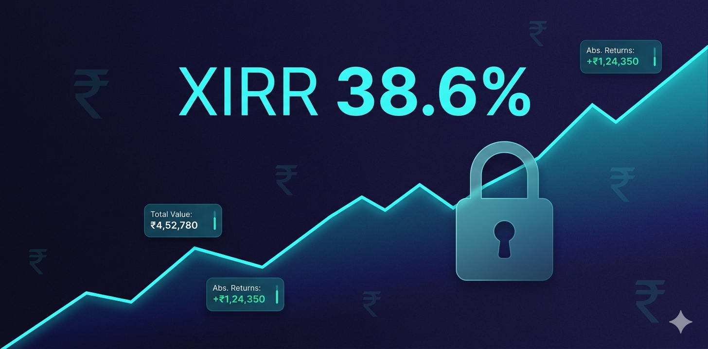

<div align="center">
  
</div>

<br />

<div align="center">

# FolioVault

### Know your real returns. XIRR tracking for Indian investors.

*Track MF, stocks, gold, and FD investments. Calculate XIRR, Tax P&L, and goal progress —*
*100% private, runs entirely in your browser.*

<br />

[](#license)
[](https://foliovault.harmnix.com)
[](https://developer.mozilla.org/en-US/docs/Web/Progressive_web_apps)
[](https://www.typescriptlang.org/)
[](https://developer.mozilla.org/en-US/docs/Web/API/IndexedDB_API)
[](https://workers.cloudflare.com/)

<br />

**[🔗 foliovault.harmnix.com](https://foliovault.harmnix.com)**

</div>

---

## Contents

- [Overview](#overview)
- [Features](#features)
- [Tech Stack](#tech-stack)
- [How It Works](#how-it-works)
- [Getting Started](#getting-started)
- [Usage](#usage)
- [Pricing](#pricing)
- [Roadmap](#roadmap)
- [Privacy & Data](#privacy--data)
- [Publishing to a Public Repo](#publishing-to-a-public-repo)
- [License](#license)
- [Author](#author)

---

## Overview

FolioVault is a **privacy-first, offline-first investment portfolio tracker** built specifically for Indian retail investors. Most portfolio trackers (Zerodha Coin, Groww, Kuvera) store your entire financial picture on their servers — your holdings, purchase history, and returns are all visible to the platform.

FolioVault stores everything in your browser's IndexedDB. Your investment data never leaves your device. XIRR calculations, Tax P&L, and net worth — all computed locally using live NAV and price data fetched on demand.

---

## Features

### Core Portfolio Tracking

**Multi-Asset Support** — Track Mutual Funds (direct and regular), Indian stocks (NSE/BSE), gold (Sovereign Gold Bonds, physical), and Fixed Deposits in one unified dashboard.

**XIRR Calculation** — True time-weighted returns using the XIRR algorithm (Newton-Raphson method). Accounts for every SIP instalment and partial redemption. Unlike simple returns, XIRR reflects the actual compounded annualised return of your investments.

**Live NAV Fetch** — Mutual fund NAVs fetched on demand from MFAPI.in (free, no auth required). Stock prices fetched from Yahoo Finance API. No stale data.

**Absolute Returns** — Shows both absolute returns (₹ gain/loss) and percentage returns alongside XIRR for every holding and at portfolio level.

**Net Worth Dashboard** — Aggregated view of total invested, current value, absolute gain, and XIRR across all assets.

### Tax & Compliance Tools *(Pro)*

**Tax P&L Calculator** — Computes Short-Term Capital Gains (STCG) and Long-Term Capital Gains (LTCG) per holding based on Indian tax rules:
- Equity MF / Stocks: STCG at 15% (< 1 year), LTCG at 10% (> 1 year, above ₹1L)
- Debt MF: Taxed at income slab rate (post-April 2023 rules)
- Gold / SGBs: STCG at slab rate (< 3 years), LTCG at 20% with indexation (> 3 years)

**GSTR-Equivalent Export** — Export Tax P&L summary as a CA-ready PDF or CSV, organized by financial year.

### Goal & SIP Planner *(Pro)*

**Goal Tracker** — Create financial goals (retirement corpus, house down payment, child education). Map holdings to goals. Track % completion and projected achievement date.

**SIP Calculator** — Project future corpus from monthly SIP with expected CAGR. Compare scenarios side by side.

**Rebalancing Engine** — Input your target asset allocation (e.g., 60% equity, 30% debt, 10% gold). The engine shows current drift and suggests buy/sell amounts to rebalance.

### Additional Tools *(Pro)*

**EPF Tracker** — Manually log EPF contributions and interest credits. Tracks EPF corpus alongside market investments.

**Watchlist** — Add stocks and MFs to a watchlist with target buy price alerts. Purely local — no account needed.

**AES-256-GCM Encrypted Backup** — Export your entire portfolio data as an encrypted JSON backup. The encryption key is derived from a user-set passphrase — FolioVault itself cannot decrypt your backup.

---

## Tech Stack

| Layer | Technology | Purpose |
|:------|:-----------|:--------|
| **Frontend** | TypeScript (compiled) | Type-safe component architecture |
| **Styling** | CSS3 Custom Properties | Dark theme, cyan accent design system |
| **Charts** | Chart.js | Portfolio allocation, returns trends, goal progress |
| **Storage** | Dexie.js (IndexedDB wrapper) | All investment data stored locally |
| **MF Data** | MFAPI.in | Live mutual fund NAVs (free API, no auth) |
| **Stock Data** | Yahoo Finance API | Live stock prices via proxy |
| **Encryption** | Web Crypto API (AES-256-GCM) | Encrypted backup with passphrase-derived key |
| **Payments** | Razorpay Checkout SDK | Pro subscription billing |
| **Backend** | Cloudflare Workers | License verification + payment API |
| **KV Store** | Cloudflare KV | License keys storage |
| **Hosting** | Cloudflare Pages | Global edge CDN, PWA support |

---

## How It Works

### Data Flow

```
User adds a holding (e.g., Parag Parikh Flexi Cap — ₹10,000 SIP)
  └─► Save transaction to IndexedDB (transactions table)
  └─► No network request — purely local

User refreshes portfolio
  └─► Read all transactions from IndexedDB
  └─► Fetch latest NAV from MFAPI.in (one request per unique fund)
  └─► Compute current value, absolute return, XIRR locally
  └─► Render dashboard — NAV data not stored, always fresh

User runs Tax P&L (Pro)
  └─► Read all buy/sell transactions from IndexedDB
  └─► Apply STCG/LTCG rules per asset class and holding period
  └─► Output tax summary per financial year
  └─► Generate PDF/CSV — no data ever leaves device

User exports encrypted backup (Pro)
  └─► Read all data from IndexedDB
  └─► Encrypt with AES-256-GCM (key = PBKDF2(passphrase, salt))
  └─► Download as .fvault file — FolioVault cannot decrypt this
```

### Where Data Lives

| Data Type | Stored In | Persists? | Encrypted? | Server Access? |
|:----------|:----------|:----------|:-----------|:---------------|
| Holdings & transactions | IndexedDB | Yes | No | 🚫 Never |
| Goals and targets | IndexedDB | Yes | No | 🚫 Never |
| Watchlist | IndexedDB | Yes | No | 🚫 Never |
| EPF records | IndexedDB | Yes | No | 🚫 Never |
| Settings | IndexedDB | Yes | No | 🚫 Never |
| Encrypted backup | User's device | User-controlled | AES-256-GCM | 🚫 Never |
| License keys | Cloudflare KV | Yes | No | ✅ Worker only |
| Payment records | Razorpay | Yes | Yes (TLS) | ✅ Razorpay only |

---

## Getting Started

### Quick Start

No installation — open and start tracking immediately:

**[➡️ Open FolioVault](https://foliovault.harmnix.com)**

### Local Development

```bash
# Clone the repository
git clone <your-repo-url>
cd foliovault

# Install dependencies
npm install

# Start dev server
npm run dev

# Build for production
npm run build
```

### Worker Setup *(for Pro features)*

```bash
cd worker

# Install Wrangler
npm install -g wrangler
wrangler login

# Create KV namespace
wrangler kv:namespace create "LICENSES"
# Copy the returned ID into worker/wrangler.toml

# Set secrets
wrangler secret put RAZORPAY_KEY_ID
wrangler secret put RAZORPAY_KEY_SECRET
wrangler secret put RAZORPAY_WEBHOOK_SECRET
wrangler secret put LICENSE_SECRET

# Deploy
wrangler deploy
```

### Environment Variables

```env
# Required for payment processing
VITE_RAZORPAY_KEY_ID=rzp_live_YOUR_KEY_ID

# Optional: override worker API URL
VITE_API_URL=https://api.YOUR_DOMAIN.com
```

---

## Usage

### 1. Add Your First Holding

1. Go to **Portfolio** → **＋ Add Holding**
2. Select asset type: Mutual Fund / Stock / Gold / FD
3. For Mutual Funds: search by name or scheme code (autocomplete from MFAPI.in)
4. Enter transaction details: date, amount, units, price per unit
5. Click **Save** — XIRR and current value calculate instantly

### 2. Read Your Returns

- **Dashboard** shows total invested, current value, absolute gain, and portfolio XIRR
- Each holding shows its individual XIRR alongside absolute returns
- Allocation chart shows your current asset distribution
- Refresh to fetch latest NAV/price data

### 3. Track Goals *(Pro)*

1. Go to **Goals** → **＋ New Goal**
2. Enter goal name, target amount, and target date
3. Map existing holdings to this goal
4. Dashboard shows % complete and projected achievement date

### 4. Run Tax P&L *(Pro)*

1. Go to **Tax** → select financial year
2. View STCG and LTCG breakdown per holding
3. Export as PDF for your CA or self-filing

### 5. Encrypted Backup *(Pro)*

1. Go to **Settings** → **Backup**
2. Set a passphrase (not stored anywhere — remember it)
3. Click **Export Backup** — downloads a `.fvault` file
4. To restore: upload the file, enter your passphrase → all data restored

### 6. Upgrade to Pro

1. Click **Upgrade** from sidebar or dashboard
2. Choose Monthly (₹149) or Annual (₹999)
3. Pay via Razorpay (UPI, card, net banking, wallet)
4. Pro features unlock immediately

---

## Pricing

| Plan | Price | Holdings | Features |
|:-----|:------|:---------|:---------|
| **Free** | ₹0 | Up to 10 | Portfolio tracking, XIRR, live NAV, net worth dashboard |
| **Pro** | ₹999/yr (₹149/mo) | Unlimited | Tax P&L, Goal Tracker, SIP Calculator, Rebalancing Engine, EPF Tracker, Watchlist, Encrypted Backup |

---

## Roadmap

### Completed
- [x] Multi-asset portfolio tracking (MF, stocks, gold, FD)
- [x] XIRR calculation (Newton-Raphson)
- [x] Live NAV fetch from MFAPI.in
- [x] Live stock prices from Yahoo Finance
- [x] Absolute returns + percentage returns
- [x] Net worth dashboard
- [x] Tax P&L Calculator (STCG/LTCG per Indian rules) *(Pro)*
- [x] Goal Tracker *(Pro)*
- [x] SIP Calculator *(Pro)*
- [x] Rebalancing Engine *(Pro)*
- [x] EPF Tracker *(Pro)*
- [x] Watchlist *(Pro)*
- [x] AES-256-GCM encrypted backup *(Pro)*
- [x] Razorpay payment integration
- [x] PWA offline support

### Planned
- [ ] CAMS/Karvy CAS statement import (auto-populate MF holdings)
- [ ] Zerodha P&L export import
- [ ] Capital gains tax harvesting suggestions
- [ ] NPS tracker
- [ ] PPF tracker
- [ ] Multi-currency support (for US stocks)
- [ ] Dark/light mode toggle

---

## Privacy & Data

Your financial data never leaves your device unless you explicitly export it.

### Network Activity

| Action | Data Sent | Destination | Trigger |
|:-------|:----------|:------------|:--------|
| NAV fetch | Scheme code | MFAPI.in | Clicking Refresh |
| Stock price fetch | Ticker symbol | Yahoo Finance (via proxy) | Clicking Refresh |
| License Validation | License key | Cloudflare Worker | App load |
| Payment Order | Plan type, amount | Cloudflare Worker | Clicking Pay |
| Payment Confirmation | Payment ID, Order ID | Cloudflare Worker | After payment |

The Cloudflare Worker stores only license keys and payment records. It has **zero access** to your portfolio data, transactions, or financial records.

---

## Publishing to a Public Repo

### Sanitized Files

| File | What Was Changed |
|:-----|:-----------------|
| `worker/wrangler.toml` | KV namespace ID, domain → placeholders |
| `src/lib/license.ts` | Hardcoded worker URL → `import.meta.env.VITE_API_URL` |
| `src/lib/payments.ts` | Hardcoded Razorpay key → `import.meta.env.VITE_RAZORPAY_KEY_ID` |

### Before You Deploy

1. In `worker/wrangler.toml`: replace `YOUR_KV_NAMESPACE_ID` and `YOUR_DOMAIN`
2. Set Worker secrets: `RAZORPAY_KEY_ID`, `RAZORPAY_KEY_SECRET`, `RAZORPAY_WEBHOOK_SECRET`, `LICENSE_SECRET`
3. Configure `VITE_RAZORPAY_KEY_ID` in Cloudflare Pages environment variables
4. Update `VITE_API_URL` to your deployed Worker URL

---

## License

© 2025 Harmnix. All rights reserved.

This source code is provided for portfolio and reference purposes only. Commercial use, redistribution, or self-hosting is not permitted.

---

## Author

Built by **[Harmnix](https://harmnix.com)** — a portfolio of developer tools and productivity apps for Indian users.

- Live App: [foliovault.harmnix.com](https://foliovault.harmnix.com)
- Portfolio: [harmnix.com](https://harmnix.com)
